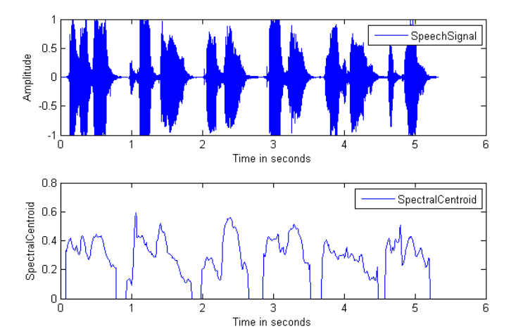
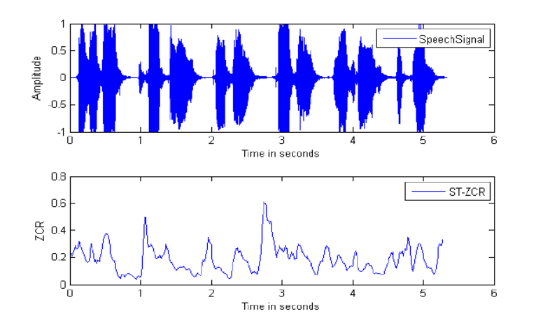

# Music-Genre-Classification

## Overview

The Purpose of this Project was to developing a machine learning model that classifies music into genres automatically based on various features, instead of manually entering the genre. Another objective is to reach a good accuracy so that the model classifies new music into its genre correctly. This model should be better than at least a few preexisting models.

## Link

https://music-genre-classifier4.herokuapp.com/

(The link takes a while to load since it is hosted for free on heroku)

## Languages:

- Python(BackEnd)
- HTML
- CSS
- JS

## Configuration:

### Requirements:

To run the project you need to have following requirements

- You must have python(preferably latest version) and you must have follow libraries.

  1. librosa
  2. Flask
  3. numpy
  4. tensorflow
  5. scikit-learn
  6. scipy
  7. And many more..
     You can install them by using:

  `pip install -r requirements.txt`

- And you must have latest browser with scripts allowed.

### How to run it locally:

To run this on your machine. Firstly clone the repositories to your required folder. Make a python virtual enviroment preferably(You can still directly use python). Install the required libraries.Then run the file "app.py". It will give a local address (127.0.0.1 or localhost). Just run that on your brower and you'll find it running.

## How to use it:

1. Upload .wav file
2. Click Submit Button. Easy as that :).

## How it works:

### Dataset For Training Used:

GTZAN Genre Collection dataset was used to perform the classification. Dataset consists of
1000 audio tracks each 30 seconds long. It contains 10 genres (Blues, Classical, Country, Disco,
Hip-Hop, Jazz, Metal, Pop, Reggae and Rock), each represented by 100 tracks. The tracks are all
22050Hz Mono 16-bit audio files in .wav format. It also contains the Mel spectrograms of the
audios. It also has the features in the .csv file. The features include (Name, length, chroma_stft,
5
spectral_bandwidth, roll off, zero_crossing_rate, harmony, perceptr, tempo, mfcc1_mean,
20_mfcc, label etc.).

### Feature Extraction:

The following features were extracted from an audio file for both testing and training of the model:

#### Chromagram of an Audio:

The Chromagram is a transformation of a signal's time-frequency properties into a
temporally varying precursor of pitch. This transformation is based on perceptual observations
concerning the auditory system and has been shown to possess several interesting mathematical
properties. We illustrate the use of the Chromagram as a fast and robust method for visualizing
attributes of a singer's voice, which is relatively variant to changes in the vocal tract resonances.

(a) Musical score of a C-major scale. (b) Chromagram obtained from the score. (c) Audio
recording of the C-major scale played on a piano. (d) Chromagram obtained from the audio
recording.

#### Spectral Centroid:

The spectral centroid is a measure used in digital signal processing to a spectrum. It indicates
where the center of mass of the spectrum is located. Perceptually, it has a robust connection with
the impression of the brightness of a sound.

#### Spectral Bandwidth:

It is the Wavelength interval in which a radiated spectral quantity is not less than half its
maximum value. It is a measure of the extent of the Spectrum.

#### Roll off:

Roll-off is the steepness of a transfer function with frequency, particularly in electrical network
analysis, and most especially in connection with filter circuits in the transition between a passband
and a stopband. It is most typically applied to the insertion loss of the network, but can, in principle,
be applied to any relevant function of frequency, and any technology, not just electronics. It is
usual to measure roll-off as a function of logarithmic frequency; consequently, the units of roll-off
are either decibels per decade (dB/decade), where a decade is a tenfold increase in frequency, or
decibels per octave (dB/8ve), where an octave is a twofold increase in frequency.
Plot of Roll off of an audio signal

#### Zero Crossing:

The zero-crossing rate (ZCR) is the rate at which a signal changes from positive to zero to negative
or from negative to zero to positive. Its value has been widely used in both speech recognition and
music information retrieval, being a key feature to classify percussive sounds.
Plot of audio signal and its Number of Zero Crossing in an Interval

#### Harmony:

In music, harmony is the process by which the composition of individual sounds, or superpositions
of sounds, is analyzed by hearing. Usually, this means simultaneously occurring frequencies,
pitches (tones, notes), or chords. Harmony is a perceptual property of music, and, along with
melody, one of the building blocks of Western music. Its perception is based on consonance, a
concept whose definition has changed various times throughout Western music. In a physiological
approach, consonance is a continuous variable. Consonant pitch relationships are described as
sounding more pleasant, euphonious, and beautiful than dissonant relationships which sound
unpleasant, discordant, or rough.
Plot of audio signal, Pitch Estimations and its Harmonic Ratio.

#### Tempo:

In musical terminology, tempo is the speed or pace of a given piece. In classical music,
tempo is typically indicated with an instruction at the start of a piece and is usually measured in
beats per minute.

#### MFCC:

Mel-frequency cepstral coefficients (MFCCs) are coefficients that collectively make up an MFC.Each MFCCS is made by applying following steps:

1. Take the Fourier transform of (a windowed excerpt of) a signal.
2. Map the powers of the spectrum obtained above onto the mel scale, using triangular overlapping windows or alternatively, cosine overlapping windows.
3. Take the logs of the powers at each of the mel frequencies.
4. Take the discrete cosine transform of the list of mel log powers, as if it were a signal.
5. The MFCCs are the amplitudes of the resulting spectrum.

I took 20 mfccs of 30 second of a single song.

### Training:

Neural Net model used for training are

#### LSTM (Long Short Term Memory):

Long short-term memory (LSTM) is an artificial recurrent neural network (RNN) architecture used
in the field of deep learning. Unlike standard feedforward neural networks, LSTM has feedback
connections. It can process not only single data points (such as images) but also entire sequences
of data (such as speech or video). For example, LSTM applies to tasks such as unsegmented,
10
connected handwriting recognition, speech recognition, and anomaly detection in network traffic
or IDSs (intrusion detection systems).

#### Reason for not using it:

The LSTM requires 3D data. So, I had to extract features according to that even after doing that
the model was overfitting. There can be many reasons for this happening. I tried most of the
solutions which included decreasing the complexity or features but I think the main reason was
that the features extracted were not of good quality and there was not enough data for data set.

#### Dense Layer:

In any neural network, a dense layer is a layer that is deeply connected with its preceding
layer which means the neurons of the layer are connected to every neuron of its preceding layer.
This layer is the most commonly used in artificial neural network networks. The dense layer’s
neuron in a model receives output from every neuron of its preceding layer, where neurons of the
dense layer perform matrix-vector multiplication. Matrix vector multiplication is a procedure
where the row vector of the output from the preceding layers is equal to the column vector of the
dense layer. The general rule of matrix-vector multiplication is that the row vector must have as
many columns as the column vector.
The general formula for a matrix-vector product is:

Where A is a (M x N) matrix and x is a (1 x N) matrix. Values under the matrix are the trained
parameters of the preceding layers and also can be updated by the backpropagation.
Backpropagation is the most commonly used algorithm for training the feedforward neural
networks. Generally, backpropagation in a neural network computes the gradient of the loss
function concerning the weights of the network for single input or output. From the above
intuition, we can say that the output coming from the dense layer will be an N-dimensional
vector. We can see that it is reducing the dimension of the vectors. So basically a dense layer is
used for changing the dimension of the vectors by using every neuron. ReLu was used for the
activation of each neuron. And Softmax was for the final layer.

#### Model Diagram:

#### Model Explanation:

The Model Diagram shows each layers and number of neurons in each layer.The Input Layer includes all the features i mentioned above. The Dropout
randomly sets input units to 0 with a frequency of rate at each step during training time, which
helps prevent overfitting. 0.2 means 20% of inputs are zero.

#### Model Results:

The image below shows the Training and Validation Loss and accuracy. The accuracy was 70%. It could get better maybe if i configured LSTM correctly or used other models like CNN

## References:

These are references i used:

[1] Vishnupriya S, and K.Meenakshi, “Automatic Music Genre Classification using Convolution
Neural Network”, IEEE Conference 2018.

[2] G.Tzanetakis and P. Cook. “Musical genre classification of audio signals, Speech and Audio
Processing”, IEEE Transactions, July 2002.

[3] Chandsheng Xu, Mc Maddage, Xi Shao, Fang Cao, and Qi Tan, ”Musical genre classification
using support vector machines”, IEEE Proceedings of International Conference of Acoustics,
Speech, and Signal Processing, Vol. 5, pp. V-429-32, 2003.

[4] Matthew Creme, Charles Burlin, Raphael Lenain, “Music Genre Classification ”, Stanford
University, December 15, 2016.

[5] Rajeeva Shreedhara Bhat, Rohit B. R.#2 ,Mamatha K. R. SSRG International Journal of
Communication and Media Science (SSRG-IJCMS) – Volume 7 Issue 1 – Jan - April 2020 SSRG
International Journal of Communication and Media Science (SSRG-IJCMS) – Volume 7 Issue 1
– Jan - April 2020

[6] P. Nandi “Recurrent Neural Nets for Audio Classification “
https://towardsdatascience.com/recurrent-neural-nets-for-audio-classification-81cb62327990

[7] Gregory H. Wakefield” CHROMAGRAM VISUALIZATION OF THE SINGING VOICE”
Department of Electrical Engineering and Computer Science, 1301 Beal Ave., University of
Michigan, Ann Arbor, MI 48109-2122
14
https://www.isca-speech.org/archive_v0/maveba_1999/papers/mv99_024.pdf

[8]
https://en.wikipedia.org/wiki/Spectral_centroid#:~:text=The%20spectral%20centroid%20is%20a
,of%20brightness%20of%20a%20sound.
